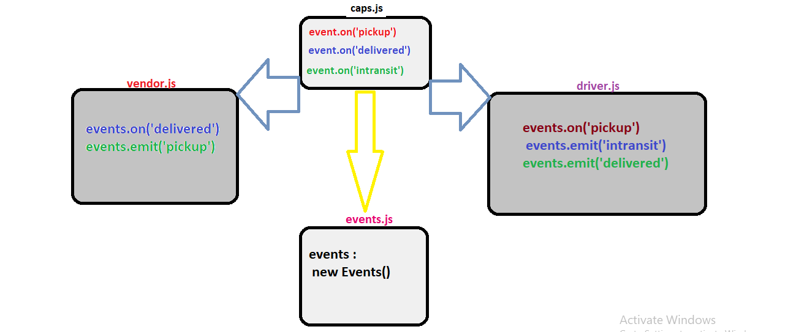

# caps

### Lab-11 

## Author : Tasnim Wheebi

### As a user :
* As a vendor, I want to alert the system when I have a package to be picked up
* As a driver, I want to be notified when there is a package to be delivered
* As a driver, I want to alert the system when I have picked up a package and it is in transit
* As a driver, I want to alert the system when a package has been delivered
* As a vendor, I want to be notified when my package has been delivered.

### As a developer :

* As a developer, I want to use industry standards for managing the state of each package
* As a developer, I want to create an event driven system so that I can write code that happens in response to events, in real time.

## Links

[Repo link](https://github.com/Tasnimwheebi/caps)

[PR](https://github.com/Tasnimwheebi/caps/pull/2)

## Installation
  
  * jest
  * dotenv
  * faker

## **Setup**
* .env requirements
  * **STORE** - **********

## **UML Diagram**

